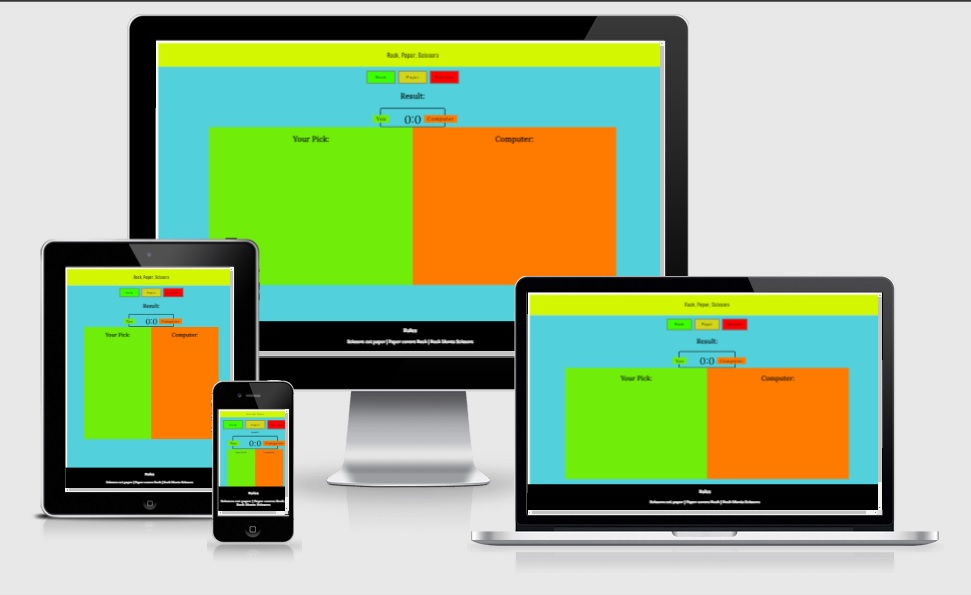
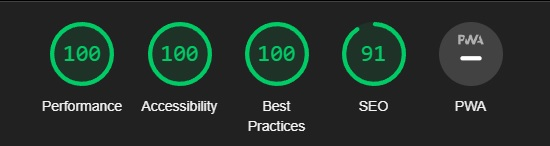

<h1 align="center">Rock Paper Scissors Game</h1>


[View project here.](https://mattiask57.github.io/project-2/)

This website is a Rock Paper Scissors Game. The site is responsive to most devices and easy to navigate for users of all kind.

- <h2 align="left"></h2>


## User Experience (UX)


-   ### User stories

    As a user i want the game to be fun

    As a user i want to be able to read the rules of the game

    -   #### User Goals

    The game should have relevant content

    The game should be fun

    The game should be able to run on all platforms


-   ### Design

    -   #### Colour Scheme

        My main colors used are #52D1DC, #d2f700, #000, #70ee09, #ff7b00 and some more.

    -   #### Typography

        I used the Smooch Sans font for headers with a fallback of Sans Serif if for some reason Smooch Sans won't load
        
        I used the Lora font for all other text in the body such as paragraphs, with a fall back of Sans Serif
        
        -   

    -   #### Imagery

        -   The image used was used to set the 


## Features


-   #### The Header


        - The header contains the name of the game.

-   #### The Game Area Section

        - The Game Area Section contains the game score of the user and computer and all the buttons and choices

-   #### The Footer

        - The Footer contains the rules for the game


## Technologies Used


### Languages Used


-   [HTML5](https://en.wikipedia.org/wiki/HTML5)

-   [CSS3](https://en.wikipedia.org/wiki/Cascading_Style_Sheets)

-   [JavaScript](https://en.wikipedia.org/wiki/JavaScript)


### Frameworks, Libraries & Programs Used


1. [Google Fonts:](https://fonts.google.com/)

    - Google fonts were used to import the Lato and Krona one fonts to the website.

2. [Git](https://git-scm.com/)

    - Git was used for version control by utilizing the Gitpod terminal to commit to Git and Push to GitHub.

3. [GitHub:](https://github.com/)

    - GitHub is used to store the projects code after being pushed from Git.


## Testing


The W3C Markup Validator, W3C CSS Validator and JSHint JavaScript Validator Services were used to validate every page of the project to ensure there were no syntax errors in the project.


-   HTML

     - No errors were returned when passing through the official W3C validator

-   CSS

     - No errors were returned when passing through the official W3C validator

-   JSHint

     - No errors were returned when passing through the official JSHint validator

- Accessibility

    - I used the lighthouse tool from chrome dev tools to harmonize the colors.

<h2 align="left"></h2>

        
### Further Testing


-   The Website was tested on Google Chrome, Internet Explorer, and Microsoft Edge browsers.

-   The website was viewed on a variety of devices such as Desktop, Laptop, iPhoneSE & iPhoneX.


### Known Bugs


## Deployment


### GitHub Pages


The project was deployed to GitHub Pages using the following steps...


1. Log in to GitHub and locate the [GitHub Repository](https://github.com/)

2. At the top of the Repository (not top of page), locate the "Settings" Button on the menu.

    - Alternatively Click [Here](https://raw.githubusercontent.com/) for a GIF demonstrating the process starting from Step 2.

3. Scroll down the Settings page until you locate the "GitHub Pages" Section.

4. Under "Source", click the dropdown called "None" and select "Master Branch".

5. The page will automatically refresh.

6. Scroll back down through the page to locate the now published site [link](https://github.com) in the "GitHub Pages" section.


### Forking the GitHub Repository


By forking the GitHub Repository we make a copy of the original repository on our GitHub account to view and/or make changes without affecting the original repository by using the following steps...


1. Log in to GitHub and locate the [GitHub Repository](https://github.com/)

2. At the top of the Repository (not top of page) just above the "Settings" Button on the menu, locate the "Fork" Button.

3. You should now have a copy of the original repository in your GitHub account.


### Making a Local Clone


1. Log in to GitHub and locate the [GitHub Repository](https://github.com/)

2. Under the repository name, click "Clone or download".

3. To clone the repository using HTTPS, under "Clone with HTTPS", copy the link.

4. Open Git Bash

5. Change the current working directory to the location where you want the cloned directory to be made.

6. Type `git clone`, and then paste the URL you copied in Step 3.


```

$ git clone https://github.com/YOUR-USERNAME/YOUR-REPOSITORY

```


7. Press Enter. Your local clone will be created.


```

$ git clone https://github.com/YOUR-USERNAME/YOUR-REPOSITORY

> Cloning into `CI-Clone`...

> remote: Counting objects: 10, done.

> remote: Compressing objects: 100% (8/8), done.

> remove: Total 10 (delta 1), reused 10 (delta 1)

> Unpacking objects: 100% (10/10), done.

```

Click [Here](https://help.github.com/en/github/creating-cloning-and-archiving-repositories/cloning-a-repository#cloning-a-repository-to-github-desktop) to retrieve pictures for some of the buttons and more detailed explanations of the above process.


## Credits


### Code


-   I took inspiration for the game from: @wakey001 on github.

    
### Media


-   The images used for the page were taken from [here](https://freesvg.org/rock-paper-scissors).

### Acknowledgements


-   The codeinstitute slack community helped a lot.